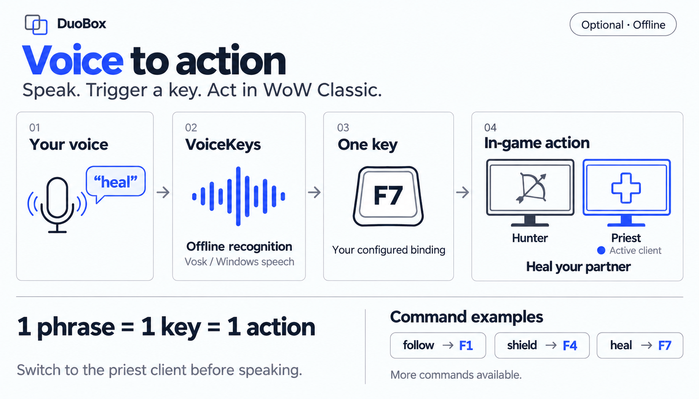

# DuoBox



World of Warcraft Classic addon for duo-boxing a healer (priest) and a DPS (hunter) on two clients,
without any key broadcasting: **1 key press = 1 action in 1 client**.

**Voice to action:** say **“heal”** → offline **VoiceKeys** recognition → **F7** → heal your partner.
Bind F7 to Heal with `/duo keys`, then speak while the priest's WoW client is focused.
VoiceKeys is optional: **1 phrase = 1 key**, sent to the active client on the same PC.
The diagram shows a few examples; see the [VoiceKeys setup and full command list](GUIDE.md#6-voicekeys-voice-commands-optional) for more.

- Cross-client alerts (low health, aggro, OOM, follow lost) with sound and taskbar flash
- Priest cast bar and facing hints on the hunter's screen
- Auto-accept invites, quests and resurrections from the partner; quest sharing and comparison
- Button bar with key bindings (`/duo keys`) and class macros (`/duo macros`)
- Optional **VoiceKeys**: offline voice commands (Vosk or Windows speech), one phrase = one key

## Install
Copy the `DuoBox` folder into `World of Warcraft\_classic_\Interface\AddOns\` on both clients, then in game:
```
/duo partner <OtherCharacterName>
```
Type `/duo` for all commands. Full documentation: [GUIDE.md](GUIDE.md).
